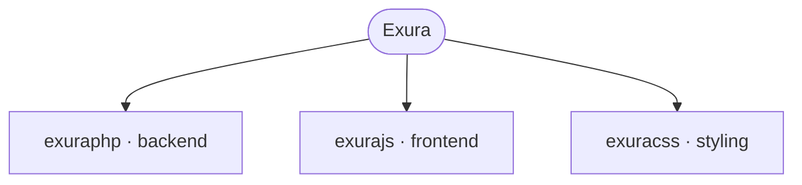

# Exura — Map

The series, across three layers of the stack.

```mermaid
graph TD
    EXU([Exura])
    EXU --> exuraphp[exuraphp · backend]
    EXU --> exurajs[exurajs · frontend]
    EXU --> exuracss[exuracss · styling]
```
