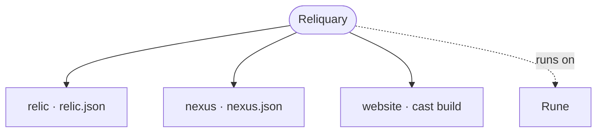

# Reliquary — Map

Built on Rune; keeps two records and publishes a page.

```mermaid
graph TD
    REL([Reliquary])
    REL --> relic[relic · relic.json]
    REL --> nexus[nexus · nexus.json]
    REL --> web[website · cast build]
    REL -.->|runs on| RUNE[Rune]
```
