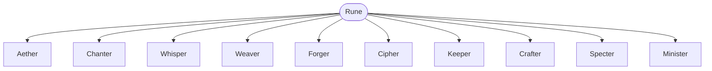

# Rune — Map

The ten origin runes. Aether flows through all of them.

```mermaid
graph TD
    RUNE([Rune])
    RUNE --> Aether
    RUNE --> Chanter
    RUNE --> Whisper
    RUNE --> Weaver
    RUNE --> Forger
    RUNE --> Cipher
    RUNE --> Keeper
    RUNE --> Crafter
    RUNE --> Specter
    RUNE --> Minister
```
